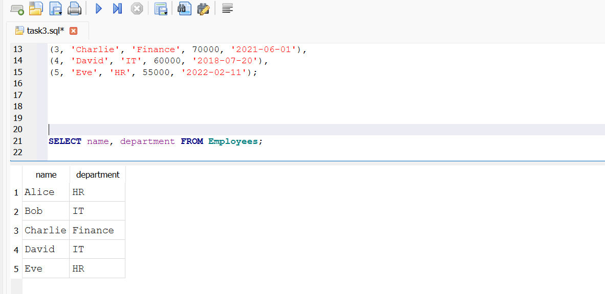

# Task 3 - Basic SELECT Queries

This task demonstrates simple SQL queries using SQLite.

 1.What does SELECT * do?
Ans. SELECT * selects all the columns from the table and displays it.

 2.How do you filter rows?
Ans. To filter rows, WHERE is used. It helps in filtering the data based on a condition.
 
 3.What is LIKE '%value%'?
Ans. It is used for pattern matching. %value% finds the record containing that value at any position.

 4.What is BETWEEN used for?
Ans. BETWEEN is used to filter values in a given range.

 5.How do you limit output rows?
Ans. To limit the number of output rows we use LIMIT value. It return that number of records.

 6.Difference between = and IN
Ans. = is used to check for one specific value in the data and IN is used to check for multiple values present in the data.

 7.How to sort in descending order?
Ans. DESC keyword is added to sort in descending order. Eg:SELECT * FROM employees ORDER BY salary DESC;

 8.What is aliasing?
Ans. It is used to give a temporary name to the column. AS is used for aliasing.

 9.Explain DISTINCT.
Ans. It removes distinct values and gives all unique ones.

 10.What is the default sort order?
Ans. The default sort order is ascending.

## Screenshots

Here are some sample query results:

### 1. Select all employees

### 2. Using where

### 3. Filtering rows

### 4. Using like

### 5. Using Between

### 6. LIMIT

### 7. Using IN

### 8. Descending order

### 9. Aliasing

### 10. Using Distinct

### 11. Default order

